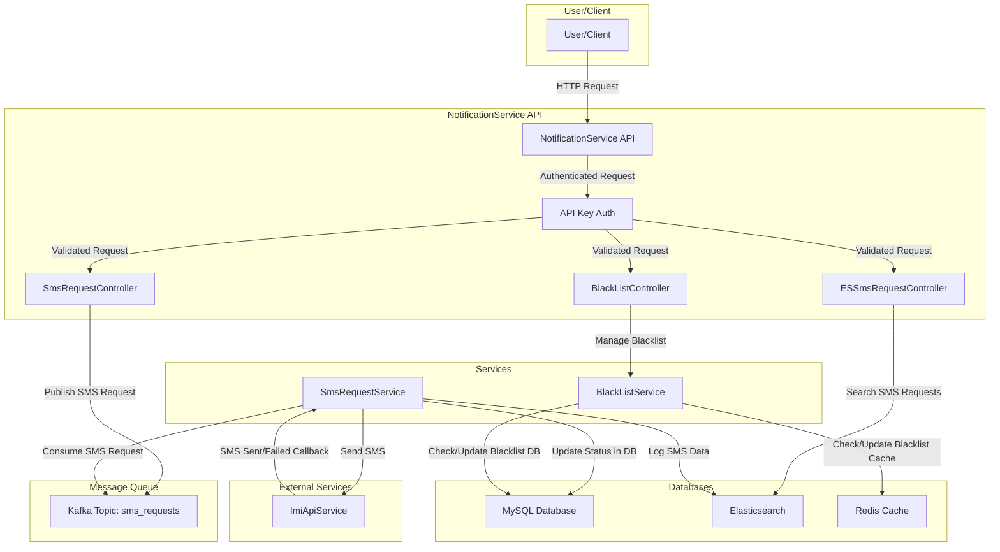

# Notification Service

## HLD


## API Documentation

### BlackListController

Base Path: `/v1`

---

**1. Add Phone Numbers to Blacklist**
-   **HTTP Method:** `POST`
-   **Full Path:** `/v1/blacklist`
-   **Description:** Adds one or more phone numbers to the blacklist.
-   **Request Parameters:** None
-   **Request Body:** `BlackListRequest`
-   **Response Body:** `GenericResponse<String>`
    -   **Success:** 200 OK
    -   **Error:** 500 Internal Server Error (due to `throws Exception`), 400 Bad Request (due to `@Valid`)

---

**2. Remove Phone Numbers from Blacklist**
-   **HTTP Method:** `DELETE`
-   **Full Path:** `/v1/blacklist`
-   **Description:** Removes one or more phone numbers from the blacklist.
-   **Request Parameters:** None
-   **Request Body:** `BlackListRequest`
-   **Response Body:** `GenericResponse<String>`
    -   **Success:** 200 OK
    -   **Error:** 400 Bad Request (due to `@Valid`)

---

**3. Get All Blacklisted Numbers**
-   **HTTP Method:** `GET`
-   **Full Path:** `/v1/blacklist`
-   **Description:** Retrieves a list of all phone numbers currently in the blacklist.
-   **Request Parameters:** None
-   **Request Body:** None
-   **Response Body:** `GenericResponse<BlackListResponse>`
    -   **Success:** 200 OK
    -   **Error:** 500 Internal Server Error (due to `throws Exception`)

---

### ESSmsRequestController

Base Path: `/v1`

---

**1. Get SMS Requests Containing Text**
-   **HTTP Method:** `GET`
-   **Full Path:** `/v1/sms/get_by_message_containing_text`
-   **Description:** Searches for SMS requests where the message body contains the specified text.
-   **Request Parameters:** None
-   **Request Body:** `GetByTextRequest`
-   **Response Body:** `GenericResponse<List<SmsRequest>>`
    -   **Success:** 200 OK
    -   **Error:** 500 Internal Server Error (due to `throws Exception`), 400 Bad Request (due to `@Valid`)

---

**2. Get SMS Requests by Phone Number in Time Window**
-   **HTTP Method:** `GET`
-   **Full Path:** `/v1/sms/get_by_phone_number_in_time_window`
-   **Description:** Retrieves SMS requests sent to a specific phone number within a given time window.
-   **Request Parameters:** None
-   **Request Body:** `GetByTimeWindowRequest`
-   **Response Body:** `GenericResponse<List<SmsRequest>>`
    -   **Success:** 200 OK
    -   **Error:** 500 Internal Server Error (due to `throws Exception`), 400 Bad Request (due to `@Valid`)

---

### SmsRequestController

Base Path: `/v1`

---

**1. Send SMS**
-   **HTTP Method:** `POST`
-   **Full Path:** `/v1/sms/send`
-   **Description:** Sends an SMS message to a specified phone number.
-   **Request Parameters:** None
-   **Request Body:** `SendSmsRequest`
-   **Response Body:** `GenericResponse<SendSmsResponse>`
    -   **Success:** 200 OK
    -   **Error:** 400 Bad Request (due to `@Valid`)

---

**2. Get SMS Request Details by ID**
-   **HTTP Method:** `GET`
-   **Full Paths:**
    -   `/v1/sms/get_sms_request_by_id`
    -   `/v1/sms/get_sms_request_by_id/{reqId}`
-   **Description:** Retrieves the details of a specific SMS request using its ID. The first path might be intended for a generic fetch or might be an oversight if `reqId` is always expected. The second path clearly uses a path variable.
-   **Request Parameters:**
    -   `reqId` (Path Variable for the path `/v1/sms/get_sms_request_by_id/{reqId}`)
-   **Request Body:** None
-   **Response Body:** `GenericResponse<SmsRequest>`
    -   **Success:** 200 OK
    -   **Error:** 500 Internal Server Error (due to `throws Exception`), 404 Not Found (if ID doesn't exist and service layer handles this)

---

## Architectural Overview

### 1. Introduction

The NotificationService is a backend system designed to handle the sending and tracking of SMS notifications. It provides APIs for clients to submit SMS requests, manage blacklists, and query the status and details of sent messages. The system is built to be resilient and scalable, leveraging asynchronous processing and multiple data stores for different purposes.

### 2. Core Technologies

The service utilizes a modern Java-based stack:

*   **Spring Boot (v2.7.2)**: Provides the core framework for building the application, including REST API development, dependency injection, and component management.
*   **Spring Security**: Handles API authentication, specifically using an API Key based mechanism as seen in the `com.notificationservice.auth` package.
*   **Apache Kafka**: Acts as a message broker for asynchronous processing of SMS requests, enhancing decoupling and fault tolerance. Spring Kafka is used for integration.
*   **MySQL**: Serves as the primary relational database for storing transactional data such as SMS request details (e.g., `SmsRequest` entity) and persisted blacklist information (e.g., `PhoneNumber` entity in blacklist). Spring Data JPA is used for database interaction.
*   **Elasticsearch**: Used as a document store for indexing and searching SMS request data (e.g., `ESSmsRequest` document), facilitating quick lookups, logging, and analytics. Spring Data Elasticsearch provides the integration.
*   **Redis**: An in-memory data store used for caching, primarily for fast access to blacklisted phone numbers. Spring Data Redis and Jedis client are used.
*   **Java 1.8**: The programming language used for development.
*   **Maven**: Used for project build and dependency management.
*   **Log4j2**: Used for application logging, configured as the logging framework.

### 3. Component Breakdown

The NotificationService is structured into several key components, as observed in the `src/main/java/com/notificationservice` directory:

*   **Spring Boot Application (`NotificationServiceApplication.java`)**:
    *   The main application class that bootstraps the Spring Boot context. It hosts all other components, including APIs, services, and configurations.

*   **REST APIs (`com.notificationservice.controllers`)**:
    *   These are the entry points for all client interactions, mapped under the `/v1` base path.
    *   `SmsRequestController`: Handles incoming requests for sending SMS messages (`/sms/send`) and retrieving details of specific SMS requests (`/sms/get_sms_request_by_id/{reqId}`).
    *   `BlackListController`: Manages the phone number blacklist (`/blacklist`), allowing clients to add, remove, and view blacklisted numbers.
    *   `ESSmsRequestController`: Provides endpoints to query SMS request data stored in Elasticsearch, enabling searches by message content (`/sms/get_by_message_containing_text`) or by phone number within a time window (`/sms/get_by_phone_number_in_time_window`).

*   **API Authentication (`com.notificationservice.auth`)**:
    *   API access is secured using an API Key authentication mechanism.
    *   `APIKeyAuthFilter`: A custom Spring Security filter that intercepts incoming requests to validate the provided API key against configured values for paths matching `/v1/**`.
    *   `APISecurityConfig`: Configures Spring Security to integrate the custom API key authentication filter into the security chain.

*   **Service Layer (`com.notificationservice.services`)**:
    *   This layer encapsulates the core business logic of the application.
    *   `SmsRequestService`: Orchestrates the SMS sending process. It interacts with the blacklist, the external SMS provider, and updates data stores.
    *   `KafkaProducerService`: Responsible for publishing messages (e.g., new SMS requests) to the configured Kafka topic (`send_sms` as per `Constants.java`).
    *   `KafkaConsumerService`: Listens to the Kafka topic and passes messages to the appropriate services for processing (specifically, to `SmsRequestService` for handling SMS requests).
    *   `BlackListService`: Manages blacklist logic, coordinating between Redis and MySQL for blacklist checks and updates.
    *   `RedisBlackListService`: Provides an abstraction for interacting with Redis for caching blacklist data, ensuring fast lookups.
    *   `ESSmsRequestService`: Handles business logic related to querying SMS data from Elasticsearch.
    *   `ImiApiService` (`com.notificationservice.services.external`): An external service client responsible for communicating with the third-party SMS provider (IMI Connect) to actually send the SMS.

*   **Data Persistence**:
    *   **MySQL (`com.notificationservice.models.entity`, `com.notificationservice.repositories`)**:
        *   Entities like `SmsRequest` (for SMS details) and `PhoneNumber` (for blacklisted numbers) define the schema for relational data.
        *   Repositories such as `SmsRequestRepository` and `BlackListRepository` (extending Spring Data JPA's `JpaRepository`) provide CRUD operations for MySQL. MySQL acts as the source of truth for SMS request statuses and the complete blacklist.
    *   **Elasticsearch (`com.notificationservice.models.elasticsearch`, `com.notificationservice.repositories.elasticsearch`)**:
        *   Documents like `ESSmsRequest` are used for storing denormalized SMS data optimized for searching.
        *   `ESSmsRequestRepository` (extending Spring Data Elasticsearch's `ElasticsearchRepository`) provides search capabilities. Used for logging, detailed querying, and potentially analytics.
    *   **Redis (`com.notificationservice.config.RedisConfig`, `com.notificationservice.services.RedisBlackListService`)**:
        *   Configured via `RedisConfig` for connection details.
        *   Used as a fast key-value cache, primarily by `RedisBlackListService` to store and quickly retrieve blacklisted phone numbers, reducing load on MySQL for frequent checks.

*   **Messaging Queue (Apache Kafka)**:
    *   A Kafka topic (named "send_sms") is used to decouple the initial API request from the actual SMS sending process.
    *   When an SMS send request is received by `SmsRequestController`, it's validated and then published to the "send_sms" Kafka topic by `KafkaProducerService`.
    *   `KafkaConsumerService` subscribes to this topic (with group ID "group_id"). Upon consuming a message, it invokes `SmsRequestService` to process each SMS request asynchronously. This design improves system responsiveness and resilience against temporary failures in downstream services like the external SMS gateway.

*   **External Integration (`com.notificationservice.services.external.ImiApiService`)**:
    *   This service abstracts the communication with the external SMS gateway (IMI Connect, as per `Constants.java`). It handles the specifics of the IMI API, such as request formatting using DTOs in `com.notificationservice.dto.request.external` and `com.notificationservice.dto.response.external`, and response parsing. This isolates the rest ofthe application from these external details.

### 4. Request Flow (Example: Sending an SMS)

1.  **Client Request**: A client application sends an HTTP POST request to the `/v1/sms/send` endpoint of the `SmsRequestController`, including the recipient's phone number, message content, and a valid API key in the header.
2.  **Authentication**: The `APIKeyAuthFilter` intercepts the request and validates the API key. If invalid, the request is rejected with an unauthorized error.
3.  **Request Handling & Validation**: `SmsRequestController` receives the validated request. The `SendSmsRequest` DTO is validated (e.g., for required fields like phone number and message).
4.  **Publish to Kafka**: The controller invokes `KafkaProducerService` to publish the SMS request details as a message to the "send_sms" Kafka topic. This allows the API to return a quick acknowledgment (e.g., a request ID) to the client.
5.  **Asynchronous Processing**:
    *   `KafkaConsumerService` (running in a separate thread pool) consumes the SMS request message from the "send_sms" topic.
    *   It then passes the message to `SmsRequestService` for processing.
6.  **Business Logic in `SmsRequestService`**:
    *   **Blacklist Check**: `SmsRequestService` calls `BlackListService`. `BlackListService` first consults Redis (via `RedisBlackListService`) to check if the recipient's phone number is blacklisted. If the number is not in the Redis cache, `BlackListService` queries MySQL. If blacklisted, the process stops, and the SMS request status is updated to "BLACKLISTED" in MySQL and Elasticsearch.
    *   **External API Call**: If the number is not blacklisted, `SmsRequestService` uses `ImiApiService` to make an HTTP call to the external SMS gateway (IMI Connect) to send the SMS.
    *   **Status Update**: Based on the response from `ImiApiService` (or a callback, if implemented), `SmsRequestService` updates the status of the SMS request (e.g., "SENT", "FAILED") in the MySQL database via `SmsRequestRepository`.
    *   **Logging to Elasticsearch**: The details and final status of the SMS request are also indexed in Elasticsearch via `ESSmsRequestRepository` using the `ESSmsRequest` document model for future search and analytics.

### 5. Key Architectural Decisions

*   **Asynchronous Processing with Kafka**: The use of Kafka for queuing SMS requests is a critical design choice. It decouples the API endpoints from the potentially time-consuming SMS sending logic, improving the API's responsiveness and the system's overall resilience and scalability. It allows the system to handle bursts of requests and to retry sending messages if the external gateway is temporarily unavailable (though retry logic needs explicit implementation).
*   **Polyglot Persistence**: The system leverages multiple data storage technologies for their specific strengths:
    *   **MySQL**: For reliable transactional data and as the source of truth for core entities like SMS status and the complete blacklist.
    *   **Elasticsearch**: For powerful full-text search, logging, and real-time analytics on SMS data, enabling efficient querying of historical messages.
    *   **Redis**: For high-speed caching of frequently accessed data, specifically blacklisted phone numbers, to reduce latency for API calls and lessen the load on the primary MySQL database.
*   **Security through API Keys**: API Key based authentication, managed by Spring Security, provides a simple yet effective mechanism to control and authorize access to the NotificationService APIs.
*   **Abstraction of External Services**: The `ImiApiService` encapsulates all interactions with the third-party SMS provider. This makes the system more modular and easier to maintain. If the SMS provider changes, only this service needs modification.
*   **Layered Architecture**: The clear separation into controllers (API layer), services (business logic layer), repositories (data access layer), and models/DTOs promotes modularity, testability, and maintainability, following standard Spring Boot practices.
*   **Configuration Management**: Externalized configuration (e.g., API keys, timeouts, Kafka topic names, database URLs) is managed through Spring Boot's `application.properties` or YAML files, allowing for easier management across different deployment environments.
```
